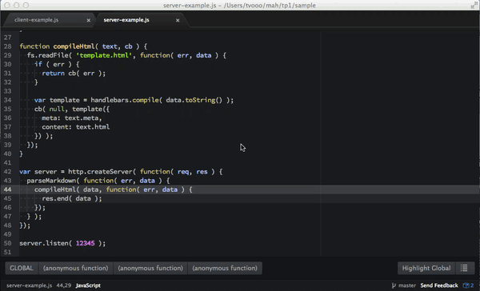
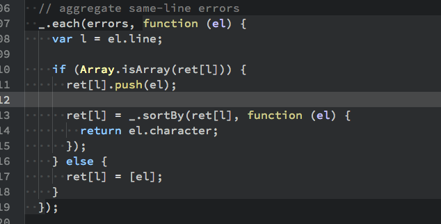
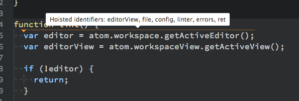
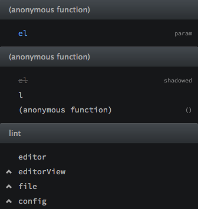

# JavaScript Scope Inspector for Atom

View your JavaScript code from a different perspective. Explore nested scopes and detect variable shadowing and hoisting.

## This is heavy work-in-progress stuff

I'm working on this as part of my Master's thesis project in Interaction Design.

Don't expect it to work perfectly, especially when it comes to parsing and analyzing the scope. This is a proof-of-concept. Please report any bugs and suggestions.

## Install

`$ apm install scope-inspector`

## Metrics & Feedback

This is **disabled** by default.

Scope Inspector is a project I'm doing for my thesis in Interaction Design. For my research, I would like to track some usage metrics. *Please enable tracking in the package's settings view*, it will help my work a great deal.

Additionally, I am happy for any qualitative feedback I get. If you're willing to participate in an interview, please send me [an email](mailto:tim@tvooo.de).

Here's what is going to be tracked:

* Your, userId which is a hash generated through your MAC address. Same as what [Atom's Metrics package](https://github.com/atom/metrics/) does.
* Plugin is enabled/disabled
* Sidebar is toggled
* Button in bottom bar is hovered (scope highlight)
* Button in bottom bar is clicked (navigate to surrounding scope)

## Features

*"Current scope"* - the scope that your cursor is placed in :)

### Inline

- Highlight current scope
  
- Indicate hoisted variables
  

### Scope Inspector (bottom bar)

- Show scope nesting
- Navigate the scope-ladder upwards
- Highlight surrounding scopes

### Sidebar

- List parameters, variables and nested functions of the current and all surrounding scopes (closest is on top, furthest [global scope] on the bottom)
- Indicate if an identifier will be hoisted  
  
- Indicate if an identifier shadows another identifier (with the same name, in a surrounding scope)  
  
- Indicate if an identifier is shadowed  
  
